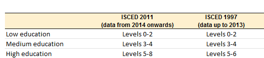

```{r setup, include=FALSE, warning=FALSE, message=FALSE}
knitr::opts_chunk$set(echo = TRUE)
library(tidyverse)
library(janitor)
library(gridExtra)
library(dplyr)
library(cowplot)
library(knitr)
```

# Introduction

## Settings software

**In our analysis we used this version of Rstudio :**
RStudio 2021.09.0+351 "Ghost Orchid" Release (077589bcad3467ae79f318afe8641a1899a51606, 2021-09-20) for Windows
Mozilla/5.0 (Windows NT 10.0; Win64; x64) AppleWebKit/537.36 (KHTML, like Gecko) QtWebEngine/5.12.8 Chrome/69.0.3497.128 Safari/537.36

And then we used these 6 packages on Rstudio:

```{r packages, eval=FALSE}
library(tidyverse)
library(janitor)
library(gridExtra)
library(dplyr)
library(cowplot)
library(knitr)
```

## Data description

In this case we have 1 dataset called **dataset.csv**.
This dataset has this number of observations and variables
:
```{r dimension, echo=FALSE,eval=TRUE}
dataset<-read.csv("dataset.csv",sep=";")
dim(dataset)
```

We have 1506 observations and 36 variables.
These variables are characters (marital status, Job role...) and numerics (job satisfaction, performance rating...).

## Data cleaning

In order to analyze this dataset we need to clean it. In fact we can have some empty cells, collumn or rows. But we can also have mistake in some values for example different way to write a word (female/Female). These mistakes could be annoying in our analysis.

First of all, I used these functions:

```{r data_cleaning, echo=TRUE,eval=TRUE}
dataset<-drop_na(dataset)
dataset<-clean_names(dataset)
dataset<-rename(dataset, age=i_age)
```

The **drop_na** functions allows us to delete every lines with "NA" inside the cells. After that the **clean_names** function corrects column titles to a standard format (no capital letters etc...). And then we used **rename** function to rename the *i_age* column to *age* column.

Then we noticed during our first analysis that some values
are inconsistent (.i.e: age in a company > 80 years old
etc...). So we decided to clean also these columns. But
also in order to make the dataset more readable we have
removed columns that we believe are useless, contain the
same data for everyone or contain personal information:

```{r first cleaning, echo=TRUE,eval=TRUE}
#Clean age and job involvement mista
dataset<-subset(dataset,age<80)
dataset<-subset(dataset,age>17)
dataset<-subset(dataset,job_involvement<100)


#Clean and delete over18 (useless column)
dataset$over18<-NULL

#Clean employees_count + employees_number (useless and sensible data)
dataset$employee_count<-NULL
dataset$employee_number<-NULL

#Clean marital status (private and useless for our analysis)
dataset$marital_status<-NULL

#Clean standard hours (same standard for every people)
dataset$standard_hours<-NULL

#Clean job
dataset<-subset(dataset, department!="")
```

Once we have cleaned up most of the columns, we also check
that all the data in a column is in the same format (.i.e.
in the gender column, or in the city column). This could
prove cumbersome if we left these columns with different
formats (analysis problems etc.):

```{r second cleaning,echo=TRUE,eval=TRUE}
#Clean the city and gender names
dataset$city<-ifelse(dataset$city=="Barcelone","Barcelona",dataset$city)
dataset$city<-ifelse(dataset$city=="Londres","London",dataset$city)
dataset$gender<-ifelse(dataset$gender=="female","Female",dataset$gender)
dataset$gender<-ifelse(dataset$gender=="female ","Female",dataset$gender)
dataset$gender<-ifelse(dataset$gender=="male","Male",dataset$gender)
dataset$department<-ifelse(dataset$department=="Research and Development","Research & Development",dataset$department)
```

# First Analysis (in overall and divide dataset)

Our first analysis is carried out with the aim of
identifying the significant differences between the two
workplaces: Barcelona and London. In order to perform
this analysis in the best possible way, we have divided
the main dataset into two parts: one concerning the
employees in Barcelona and one concerning the employees
in London :

```{r divide data,echo=TRUE,eval=TRUE}
##Divide our dataset into 2 others
dataset_london<-filter(dataset,city=="London")
dataset_barcelona<-filter(dataset,city=="Barcelona")
```

## Education level and field

Thanks to this picture we are able to traduce the
education number into education levels :


We had to use the "arrange" function because the values
were not sorted by education level, so the result on the
plot was not analyzable at all.

With this table we can then interpret this column:
```{r education analysis}
education_combined<-select(dataset,education,education_field)%>%
  arrange(education)
ggplot(education_combined, aes(fill=education, y=education, x=education_field)) + 
  geom_bar(position="stack", stat="identity")+
  labs(x="Field of education", y="Level of education")+
  theme(axis.text.x = element_text(angle = 45, vjust =1, hjust=1))
```

As we can see most of employees did an Life Sciences and
a medical education than Marketing.
Most of them have a 3 or 4 level education, a small
population has a low and high education.


# London/Barcelona analysis
## Mean age

First of all we started with some basics analysis, for example the mini, maxi, mean age in Barcelona and London:

```{r mean age}
summary(dataset_barcelona$age)
summary(dataset_london$age)
```

The age variable is rather similar between Barcelona and
London. The minimum age is the same, the maximum age is
slightly different and the average age is the same
between the two cities. 

## Traveling frequency

We will therefore compare the travel frequencies of the 2 different companies in London and Barcelona.

```{r traveling frequency table, echo=FALSE}
table(dataset_barcelona$business_travel)
table(dataset_london$business_travel)
travel_frequency<-matrix(c("","Non-Travel","Frenquently","Rarely",
                           "Barcelona",(24*100/271),(50*100/271),(197*100/271),
                           "London",(129*100/1201),(224*100/1201),(848*100/1201)),ncol =4,byrow=TRUE)
```

```{r traveling frequency visualisation}
travel_frequency
```

Thanks to the table above, we notice that in general the
percentages of the population according to their
frequency of travel are more or less identical depending
on the city. 

## Distribution of employees in the departments

In this section we will compare the distribution of
employees within the two companies. We will then draw
conclusions on one of the problems of the new CEO
concerning the succession of employees in the different
sectors.

```{r department, eval=FALSE}
department_barcelona<-ggplot(dataset_barcelona,aes(x=department))+
  geom_bar()+
  geom_text(stat='count', aes(label=..count..), vjust=0.5, color="black")+
  theme(axis.text.x = element_text(angle = 45, hjust = 1))+
  labs(x="Department in Barcelona")
department_london<-ggplot(dataset_london,aes(x=department))+
  geom_bar()+
  geom_text(stat='count', aes(label=..count..), vjust=0.5, color="black")+
  theme(axis.text.x = element_text(angle = 45, hjust=1))+
  labs(x="Department in London")
```

As we did not manage to make the texts of the X axis readable despite a correct code syntax, we will export them in JPG format.

```{r dept fix}
include_graphics(c("Rplotbcn.JPG", "Rplotldn.JPG"))
```

Analyzing the two graphs, we can see that in Barcelona
there will be a possible succession problem in the HR sector. We are going to make a more detailed
analysis to know the age of the employee in this
area.

```{r HR analysis}
HR<-filter(dataset_barcelona, department=="HR")
HR[1]
```

The only HR employee in Barcelona is 45 years old, not
yet close to retirement but not very young either. It
would be interesting to recruit an additional person in
this area so that he can pass on his knowledge and
subsequently take over the HR area in Barcelona.


## Job satisfaction, job involvement and relationship satisfaction

In this part we will analyze 3 variables corresponding to
the feelings of the employees in the 2 companies. We will
then analyze them to see if they are different variables
depending on the company.
First analysis "Job involvement" :

```{r job involvement, echo=FALSE}
job_invol<-matrix(c("Barcelona",summarize(dataset_barcelona,average=mean(job_involvement)),
                          "London",summarize(dataset_london,average=mean(job_involvement))),
                        ncol=2)
job_invol

grid.arrange(ggplot(dataset_barcelona, aes(x=job_involvement))+
  geom_bar()+labs(x="Job involvement in Barcelona",y="Number of employees"),ggplot(dataset_london, aes(x=job_involvement))+
  geom_bar()+labs(x="Job involvement in London", y="Number of employees"))
```

In this case job involvement in Barcelona is quit higher
than London (*3,38* in bcn and *2,74* in London)
Then we will analyse job satisfaction: 
:  
```{r job satisfaction, echo=FALSE}
environment_satisfaction<-matrix(c("Barcelona",summarize(dataset_barcelona,average=mean(job_satisfaction)),
                                   "London",summarize(dataset_london,average=mean(job_satisfaction))),
                                 ncol=2)
environment_satisfaction

grid.arrange(ggplot(dataset_barcelona, aes(x=job_satisfaction))+
  geom_bar()+labs(x="Job satisfaction in Barcelona",y="Number of employees"),ggplot(dataset_london, aes(x=job_satisfaction))+
  geom_bar()+labs(x="Job satisfaction in London", y="Number of employees"))
```

Whether employees are in Barcelona or London, job
satisfaction is about *2.73* on average.
And finally we will analyse "relationship satisfaction" :

```{r relationship satisfaction, echo=FALSE}
relation_satisfaction<-matrix(c("Barcelona",summarize(dataset_barcelona,average=mean(relationship_satisfaction)),
                          "London",summarize(dataset_london,average=mean(relationship_satisfaction))),
                        ncol=2)
relation_satisfaction

grid.arrange(ggplot(dataset_barcelona, aes(x=relationship_satisfaction))+
  geom_bar()+labs(x="Relation satisfaction in Barcelona",y="Number of employees"),ggplot(dataset_london, aes(x=relationship_satisfaction))+
  geom_bar()+labs(x="Relation satisfaction in London", y="Number of employees"))

```

As we can see on the 3 variables analyzed, they are
identical except for the "job involvement" variable which
is higher in Barcelona than in London.

## Salary Analysis

Through an internet search we found the average salaries
in the 2 cities in question:

- Mean salary in London = 2,839€
- Mean salary in Barcelona = 1,453.12€

Then with these values we can start the analysis:

```{r mean salary}
Salary <- rbind(matrix(c("","Mini_salary","Mean_salary","Max_salary",
                         "Barcelona",min(dataset_barcelona$monthly_income),mean(dataset_barcelona$monthly_income),max(dataset_barcelona$monthly_income)),ncol=4, nrow=2,byrow=TRUE),
                matrix(c("London",min(dataset_london$monthly_income),mean(dataset_london$monthly_income),max(dataset_london$monthly_income)),ncol=4))
Salary
``` 

Mini, mean and max are pretty similar between Barcelona
and London. It's important to remember that in Barcelona
mean salary is lower than in London
So people who live in Barcelona theoretically have more
financial resources in their in their countries than in
London.

## Distance from home 

In this section we will look at the distance between
living and working in the two companies:

```{r distance, echo=FALSE}
Distance_home <- rbind(matrix(c("","Mini_distance","Mean_distance","Max_distance",
                         "Barcelona",min(dataset_barcelona$distance_from_home),mean(dataset_barcelona$distance_from_home),max(dataset_barcelona$distance_from_home),
                         "London",min(dataset_london$distance_from_home),mean(dataset_london$distance_from_home),max(dataset_london$distance_from_home)),ncol=4,byrow=TRUE))

Distance_home
``` 

We can see that the mini distance, mean distance and maxi distance are quit the same between Barcelone and London

## Working years in general and comparaison

```{r working year gen}
summary(dataset$years_at_company)

```
Maximum 40 years in the company and mean 6,95 years in
the company.


```{r working year}
#Now let's compare Barcelona and London
summary(dataset_barcelona$years_at_company)
summary(dataset_london$years_at_company)
```
As we could expect the values are quit the same, just the
max is bigger in London than in Barcelona.

## Last training in general and comparaison

We'll start with general analysis and then compare London and Barcelona: 

```{r last training gen}
summary(dataset$training_times_last_year)
```
We have a minimum of 0 year since last training, a mean of 2,81 years and a maximum of 6 years without.

```{r last training comparaison}
summary(dataset_barcelona$training_times_last_year)
summary(dataset_london$training_times_last_year)
```

As we can see, training are quit the same in these 2 companies.

## Years in company - Years since last promotion

his calculation allows us to know in which company
employees are the most frequently promoted. This variable could be diferent and meaningful for the new CEO.
More this calculation is near 0 less the employees are
promoted:

```{r last promotion}
summarize(dataset_barcelona,Barcelona=sum(dataset_barcelona$years_at_company)-sum(dataset_barcelona$years_since_last_promotion))
summarize(dataset_london,London=sum(dataset_london$years_at_company)-sum(dataset_london$years_since_last_promotion))
```

This calculation shows that employees in London are more promoted than in Barcelona.
This is a meaningful variable for the new CEO, who may be interested in why promotions are less frequent in Barcelona than in London.

## Years with the current managers

Another variable that can be used by the new CEO is the
years with the same manager, it is possible that the fact
of changing many times of manager makes the employees 
very happy at work for example.

```{r current manager}
summarize(dataset_barcelona,Barcelona=sum(dataset_barcelona$years_with_curr_manager))
summarize(dataset_london,London=sum(dataset_london$years_with_curr_manager))
```

The calculation shows us that employees in London have
more years with the same manager than in Barcelona. It is
perhaps interesting to look at why there is such a big
difference and the impact of this variable on employees.

## Gender comparison 

Due to the CEO's concern that gender differences between London and Barcelona could be found in the company, the following will now analyze in detail to what extent differences exist between the genders and locations. 
Important note: We include employees that already have left the organization to later shift the focus on actual employees only. Historical data always offer interesting insights into a companies history to learn from and to improve certain aspects to not fall victim to changes and to not do the same mistake twice. 

```{r}
# general gender distribution in the company
gender_general <- select(dataset, gender) %>% arrange(gender)
ggplot(gender_general, aes(x= gender))+geom_bar()+geom_text(stat='count', aes(label=..count..), vjust=0.5, color="black")
```

```{r}
gender_ratio_male <- (885/(885+585))*100
gender_ratio_male

gender_ratio_female <- 585/(885+585)*100
gender_ratio_female

tab1 <- table(gender_ratio_male, gender_ratio_female)
tab1
```

In terms of gender equality a major issue can already be taken away from this plot due to the uneven distribution of genders in the company. 

Now we have to compare it for both cities to see differences and to be later able to give managerial advice to the CEO.  

```{r}
# gender distribution in barcelona offices
gender_barcelona <- select(dataset_barcelona, gender, ) %>% arrange(gender)
ggplot(gender_barcelona, aes(x= gender))+geom_bar()+geom_text(stat='count', aes(label=..count..), vjust=0.5, color="black")+ ggtitle("Gender distribution in Barcelona offices")
```
```{r}
barcelona_ratio_male <- (157/(113+157))*100
barcelona_ratio_male

barcelona_ratio_female <- 113/(113+157)*100
barcelona_ratio_female

tab2 <- table(barcelona_ratio_male, barcelona_ratio_female)
tab2
```

The different ratios from Barcelona offices cover more or less the ratios of the whole company. No evidence for worse gender equality could be found even though the company is still far away from a 50:50 ratio between both genders. 

Now we compare the Barcelona distribution with London´s. 

```{r}
# gender distribution in london offices
gender_london <- select(dataset_london, gender) %>% arrange(gender)
ggplot(gender_london, aes(x= gender))+geom_bar()+geom_text(stat='count', aes(label=..count..), vjust=0.5, color="black")+ ggtitle("Gender distribution in London offices")+ theme_bw()
```
```{r}
london_ratio_male <- (728/(472+728))*100
london_ratio_male

london_ratio_female <- (472/(472+728))*100
london_ratio_female

tab3 <- table(london_ratio_male, london_ratio_female)
tab3
```

Comparing the two locations, it becomes clear that there is hardly any difference between them. In Barcelona, the gender ratio is just under 2% more balanced. 
From the view of the company, measures should be taken to balance out the gender distribution in general for both London and Barcelona offices. In terms of equal structure and organization of both offices, it could be seen as fullfilled but both should improve their work environment. 

Now, we take a look at the satisfaction ratios for both cities and genders. 

```{r}
#job satisfaction by city and gender
ggplot(dataset,
       aes(x= gender,
           y=job_satisfaction,
           fill=city)) +
  geom_violin() +
  theme(axis.text.x=element_text(angle=90,hjust=1,vjust=0.5),
        legend.position="right") +
  ggtitle("Density of job_satisfaction by city and gender")
```

From both shapes we can see that the Barcelona has a more homogeneous distribution of job satisfaction for both genders. London has more peaks within the job satisfaction rates. 

```{r}
#monthly income by gender
ggplot(dataset,
       aes(x= gender,
           y= monthly_income,
           fill=city)) +
  geom_violin() +
  theme(axis.text.x=element_text(angle=90,hjust=1,vjust=0.5),
        legend.position="right") +
  ggtitle("Density of  job satisfaction by city and gender")
```

The pay rates are equally distributed what also the following graph shows. 

```{r}
#monthly income by gender and age in Barcelona
library(hrbrthemes)
library(viridis)
ggplot(dataset_barcelona, aes(x=monthly_income, y=age, color = gender)) +
    geom_point(alpha=0.5, shape =21 ) + scale_fill_viridis(discrete=TRUE, guide=FALSE, option="A") +ggtitle("Barcelona: Monthly income by Gender and Age")+
    theme_ipsum() + geom_smooth(method="loess")+
    theme(legend.position="bottom") +
    ylab("Age") +
    xlab("Monthly Income") 
```

```{r}
#monthly income by gender and age in London
library(hrbrthemes)
library(viridis)
ggplot(dataset_london, aes(x=monthly_income, y=age, color = gender)) +
    geom_point(alpha=0.5, shape =21 ) + scale_fill_viridis(discrete=TRUE, guide=FALSE, option="A") +ggtitle("London: Monthly income by Gender and Age")+
    theme_ipsum() + geom_smooth(method="loess")+
    theme(legend.position="bottom") +
    ylab("Age") +
    xlab("Monthly Income") 
```
These graphs refer to the age structure of the respective sites divided into both genders, which can be taken from the data set. The graphs do not allow any clear conclusions to be drawn about tendencies and trends. 

## Actual staff vs. ex employees 

We will now take a closer look at the productivity, pay and bonus distribution of the two sites, broken down by gender. In addition, before, we included employees that already left the organization. In a further step, we will split our dataframe again in order to see differences. 

```{r}
barcelona_actual<- filter(dataset_barcelona,attrition=="Yes")
london_actual<- filter(dataset_london, attrition == "Yes")
```

By cleaning out the employees that already have left the organization, we focus on data actually now relevant for the CEO in order to improve the gender equality situation. 

We repeat now the analysis from above to see how the actual situation is but we change the by age structured view and shift towards years the employee is working for the organization to see if the income rises equally for men and women correlating with the years somebody is working.  

```{r}
library(hrbrthemes)
library(viridis)
ggplot(london_actual, aes(x=monthly_income, y=years_at_company, color = gender)) +
    geom_point(alpha=0.5, shape =21 ) + scale_fill_viridis(discrete=TRUE, guide=FALSE, option="A") +ggtitle("London: Monthly income & Years at Company")+
    theme_ipsum() + geom_smooth(method="loess")+
    theme(legend.position="bottom") +
    ylab("Years at company") +
    xlab("Monthly Income") 
```
Although the London office still has a ~ 40:60 distribution between female and male employees, the monthly income over the years has a rising trend with slightly higher incomes for female employees at the end what is majorly influenced by the peaks regarding the income. In general one can see that the distribution is quite fair and rising over the years. As the CEO wants both offices to perform more or less equally, we now take a look at the Barcelona office. 

```{r}
library(hrbrthemes)
library(viridis)
ggplot(barcelona_actual, aes(x=monthly_income, y=years_at_company, color = gender)) +
    geom_point(alpha=0.5, shape =21 ) + scale_fill_viridis(discrete=TRUE, guide=FALSE, option="A") +
     ggtitle("Barcelona: Monthly income & Years at Company")+theme_ipsum() + geom_smooth(method="loess")+
    theme(legend.position="bottom") +
    ylab("Years at company") +
    xlab("Monthly Income") 
```

As the graph above shows, the distribution and trend are more or less the same with the same problem on the high incomes due to not enough employees gaining this high amount on money. As for the London office the incomes rise rise in trend over the years somebody is working at the company.

To gain insights on the distribution of the payout, premium payout, etc., we include other variables for our researches. 

```{r}
# hourly rate per department in london
library(hrbrthemes)
library(viridis)
ggplot(london_actual, aes(x= department, y=hourly_rate, color = gender)) +
    geom_boxplot() + scale_fill_viridis(discrete=TRUE, guide=FALSE, option="A")  + ggtitle("London: Hourly Rate per Department")+
    theme_ipsum() + geom_smooth(method="loess")+
    theme(legend.position="bottom") +
    ylab("Hourly Rate") +
    xlab("Department") 
```

Info: The hourly rate is the amount of money that you receive for each hour you spend working. As an hourly employee, you should get paid for all of the hours that you work. If an employer wants more of your time, they’ll have to pay you more.

We took a look at the hourly rate divided by the different departments and we noticed that at human resources and R&D men gain more per hours than women while women gain more in sales. 

For Barcelona the boxplot() plots the following: 

```{r}
# hourly rate per department in barcelona
library(hrbrthemes)
library(viridis)
ggplot(barcelona_actual, aes(x= department, y=hourly_rate, color = gender)) +
    geom_boxplot() + scale_fill_viridis(discrete=TRUE, guide=FALSE, option="A")  + ggtitle("Barcelona: Hourly Rate per Department")+
    theme_ipsum() + geom_smooth(method="loess")+
    theme(legend.position="bottom") +
    ylab("Hourly Rate") +
    xlab("Department") 
```

The Barcelona offices lack a gender-equal hourly rate in all departments. 

```{r}
# opportunities for advancement by gender in london
library(hrbrthemes)
library(viridis)
ggplot(london_actual, aes(x=years_in_current_role, y=years_since_last_promotion, color = gender)) +
    geom_point(alpha=0.5, shape =21 ) + scale_fill_viridis(discrete=TRUE, guide=FALSE, option="A") +
     ggtitle("London: Opportunities for advancement by gender")+theme_ipsum() + geom_smooth(method="loess")+
    theme(legend.position="bottom") +
    ylab("Years in current role") +
    xlab("Years since last promotion") 
```


```{r}
# opportunities for advancement by gender in london
library(hrbrthemes)
library(viridis)
ggplot(barcelona_actual, aes(x=years_in_current_role, y=years_since_last_promotion, color = gender)) +
    geom_point(alpha=0.5, shape =21 ) + scale_fill_viridis(discrete=TRUE, guide=FALSE, option="A") +
     ggtitle("Barcelona: Opportunities for advancement by gender")+theme_ipsum() + geom_smooth(method="loess")+
    theme(legend.position="bottom") +
    ylab("Years in current role") +
    xlab("Years since last promotion") 
```

Due to the given amount of data the distribution is more or less equal between both genders and no bigger differences could be identified.


